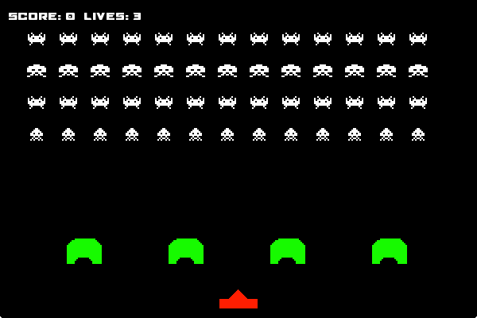

<h1 align="center">
    Space Invaders
</h1>

    
    
    
    

 

    

 

## Technologies

- Java 8

## Project

This is a Space Invaders clone game that I developed for my Object Oriented class at the university.

## Status
In Progress 🚧

## Run

Download and run the .jar file. It's required to hava Java JRE 8.

## License

This project is under the MIT License. See [LICENSE](/LICENSE.md) file for more details.